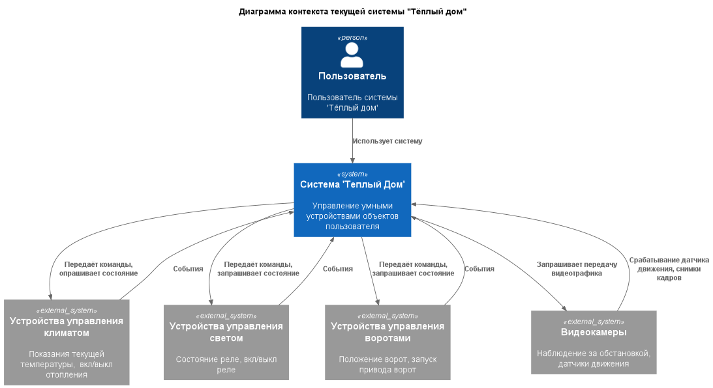
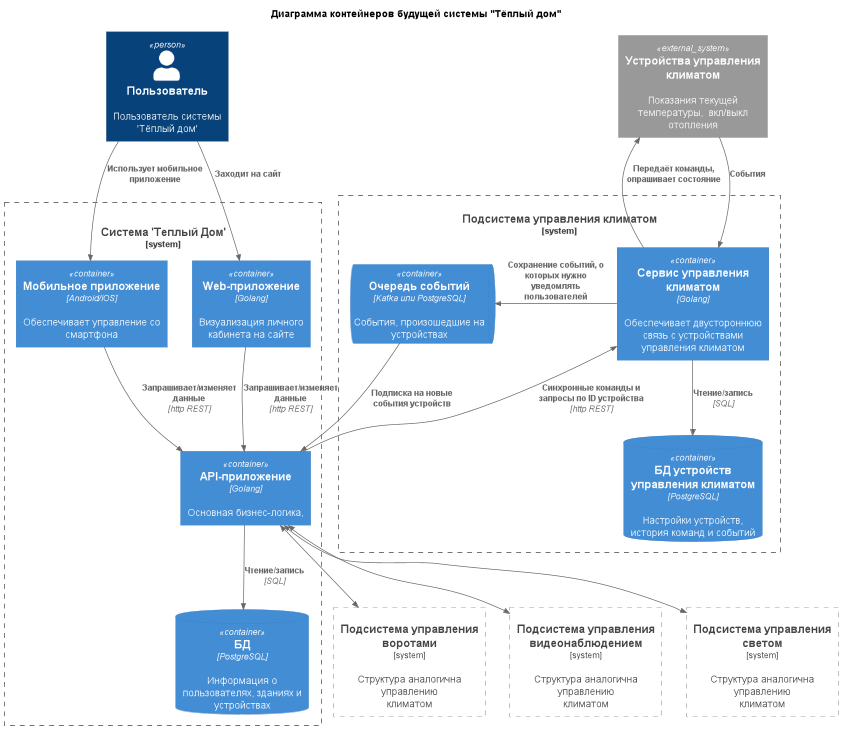
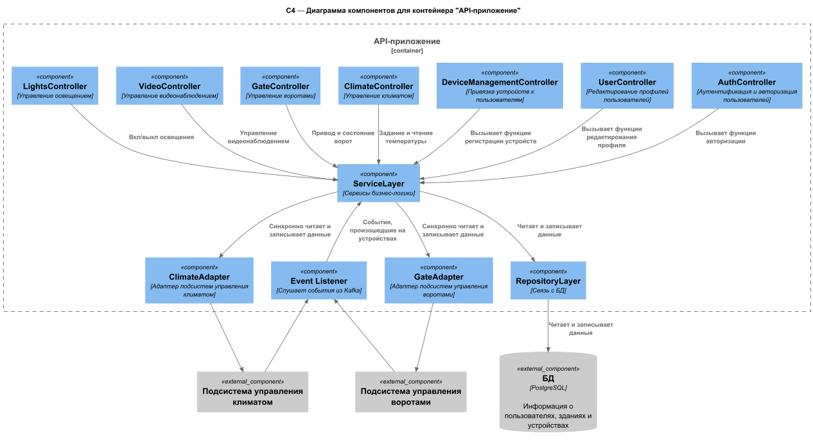
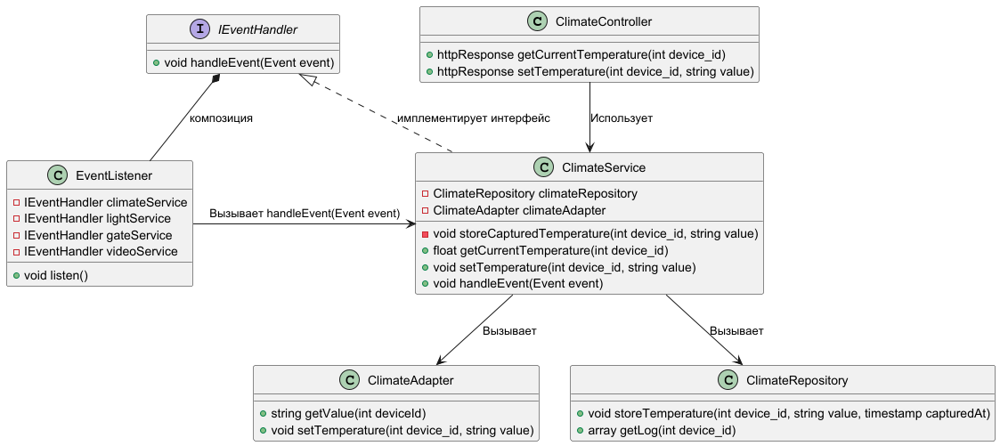
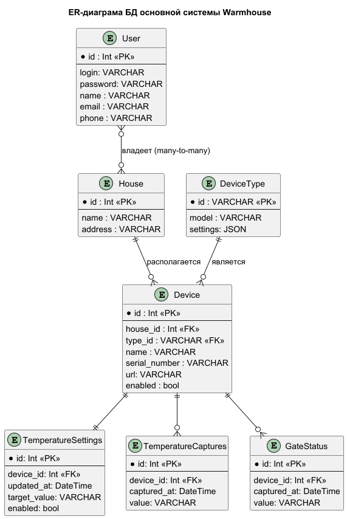

# Project_template

Это шаблон для решения проектной работы. Структура этого файла повторяет структуру заданий. Заполняйте его по мере работы над решением.

# Задание 1. Анализ и планирование

<aside>

Чтобы составить документ с описанием текущей архитектуры приложения, можно часть информации взять из описания компании и условия задания. Это нормально.

</aside>

### 1. Описание функциональности монолитного приложения

**Управление отоплением:**

- Пользователи могут удаленно вручную включать/выключать отопление в своих домах.


**Мониторинг температуры:**

- Пользователи могут просматривать текущую температуру в своих домах через веб-интерфейс
- Система получает данные о температуре с датчиков, установленных в домах, путём от правки запроса к датчику с сервера. 


### 2. Анализ архитектуры монолитного приложения

- Язык программирования: Go
- База данных: PostgreSQL
- Архитектура монолитная, все компоненты системы находятся в одном приложения.
- Развертывание через Docker и Docekr-composer
- Взаимодействие с датчиками: синхронное, от сервера к датчику.
- Возможность масштабирования ограничена. Можно масштибировать только всё приложение целиком.
- Внешние интеграции: HTTP API для получения данных о температуре


### 3. Определение доменов и границы контекстов

В будущей системе управления умным домом можно выделить такие домены:

- Домен "Управление пользователями и их объектами". 
	- Поддомены: 
		- Профиль пользователя (учетная запись, пароль);
		- Настройка объектов (домов, гаражей, ворот и т.п.).  У одного пользователя может быть несколько объектов в управлении.  
	- Сущности: User, Building

- Домен "Подключение и настройка устройств" (Device Connection)
	- Поддомены:
		- Регистрация и отключение устройств
		- Изменение внутренних настроек устройства
		- Диагностика работоспособности устройства

	Выделим два класса устройств: 
	1. "сенсоры" - пассивные устройства, которые информируют о фактическом состоянии  (температура, давление, контакт замкнут/разомкнут, и т.п )
	2. "исполнительные механизмы" - активные устройства, которые выполняют некоторое действие (переключить реле, запустить мотор, задать целевую температуру, и т.п.)

	- Сущности:
		- TemperatureSensor (датчик температуры)
		- LimitSensor (концевой выключатель)
		- Camera (видеокамера системы наблюдения)
		- Heater (нагреватель отопления)
		- AirContirioner (кондиционер)
		- Lamp (реле управление лампой освещения)
		- GateMotor (привод ворот)

- Домен "Управление климатом"
	- Поддомены:
		- Измерение фактической температуры
		- Поддержание желаемой температуры
	- Сущности:
		- TemperatureSensor (датчик температуры)
		- Heater (нагреватель отопления)
		- AirContirioner (кондиционер)
	- Объекты-значения:
		- Температура
		- Время
	- Агрегаты:
		- Расписание температурного режима

- Домен "Управление светом":
	- Сущности:
		- Lamp (реле управление лампой освещения)	
	- Агрегаты:
		- Расписание управление светом по времени
	
- Домен "Управление воротами":
	- Сущности:
		- LimitSensor (концевой выключатель)
		- GateMotor (привод ворот)

- Домен "Видеонаблюдение"
	- Сущности:
		- AlarmSensor (датчик движения)
		- Camera (видеокамера системы наблюдения)

### **4. Проблемы монолитного решения**

- Нельзя горизонтально масштабировать отдельные части приложения.
- Изменения в одном из доменов требуют новой сборки и перезапуска всего приложения
- Командам сложно работать над несколькими доменами одновременно
- Сложность расширения сисемы новыми неизвестными типами датчиков в будущем

Если вы считаете, что текущее решение не вызывает проблем, аргументируйте свою позицию.

### 5. Визуализация контекста системы — диаграмма С4

#### Диаграмма контекста 
[./schemas/c4/1-context/context.puml](./schemas/c4/1-context/context.puml)


# Задание 2. Проектирование микросервисной архитектуры

В этом задании вам нужно предоставить только диаграммы в модели C4. Мы не просим вас отдельно описывать получившиеся микросервисы и то, как вы определили взаимодействия между компонентами To-Be системы. Если вы правильно подготовите диаграммы C4, они и так это покажут.

**Диаграмма контейнеров (Containers)**

[./schemas/c4/2-containers/containers.puml](./schemas/c4/2-containers/containers.puml)


**Диаграмма компонентов (Components)**

[./schemas/c4/3-components/components.puml](./schemas/c4/3-components/components.puml)


**Диаграмма кода (Code)**

[./schemas/c4/4-code/code.puml](./schemas/c4/4-code/code.puml)


# Задание 3. Разработка ER-диаграммы

**ER-диаграмма**:
[./schemas/er/main.puml](./schemas/er/main.puml)



# Задание 4. Создание и документирование API

### 1. Тип API

Для синхронного взаимодействия выбран REST API, из-за своей простоты и распространенности.

Для обработки событий, возникающих на устройствах, была выбрана очередь на основе Kafka. 
Очередь находится как можно ближе к устройствам, чтобы накапливать даные в случае обрывов связи с центральной системой. 
Центральная система выстаупает в качестве консьюмера Kafka. 
Кроме того, данная архитектура позволит в будущем легко подключать другие микросервисы, например сервис отправки push-уведомлений. 

### 2. Документация API

REST API для сервиса управления температурой (OpenAPI 3.0):

[./schemas/openApi/ClimateServiceAPI.yaml](./schemas/openApi/ClimateServiceAPI.yaml)


# Задание 5. Работа с docker и docker-compose

Перейдите в apps.

Там находится приложение-монолит для работы с датчиками температуры. В README.md описано как запустить решение.

Вам нужно:

1) сделать простое приложение temperature-api на любом удобном для вас языке программирования, которое при запросе /temperature?location= будет отдавать рандомное значение температуры.

Locations - название комнаты, sensorId - идентификатор названия комнаты

```
	// If no location is provided, use a default based on sensor ID
	if location == "" {
		switch sensorID {
		case "1":
			location = "Living Room"
		case "2":
			location = "Bedroom"
		case "3":
			location = "Kitchen"
		default:
			location = "Unknown"
		}
	}

	// If no sensor ID is provided, generate one based on location
	if sensorID == "" {
		switch location {
		case "Living Room":
			sensorID = "1"
		case "Bedroom":
			sensorID = "2"
		case "Kitchen":
			sensorID = "3"
		default:
			sensorID = "0"
		}
	}
```

2) Приложение следует упаковать в Docker и добавить в docker-compose. Порт по умолчанию должен быть 8081

3) Кроме того для smart_home приложения требуется база данных - добавьте в docker-compose файл настройки для запуска postgres с указанием скрипта инициализации ./smart_home/init.sql

Для проверки можно использовать Postman коллекцию smarthome-api.postman_collection.json и вызвать:

- Create Sensor
- Get All Sensors

Должно при каждом вызове отображаться разное значение температуры

Ревьюер будет проверять точно так же.


# **Задание 6. Разработка MVP**

Необходимо создать новые микросервисы и обеспечить их интеграции с существующим монолитом для плавного перехода к микросервисной архитектуре. 

### **Что нужно сделать**

1. Создайте новые микросервисы для управления телеметрией и устройствами (с простейшей логикой), которые будут интегрированы с существующим монолитным приложением. Каждый микросервис на своем ООП языке.
2. Обеспечьте взаимодействие между микросервисами и монолитом (при желании с помощью брокера сообщений), чтобы постепенно перенести функциональность из монолита в микросервисы. 

В результате у вас должны быть созданы Dockerfiles и docker-compose для запуска микросервисов. 